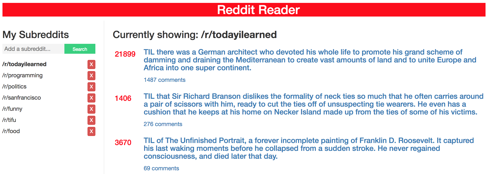

## Wonder Workshop Coding Challenge

This assignment is a streamlined Reddit reader that is implemented as a single-page application using Reactjs.

### Setup and Dependencies

1. Clone the repo
2. Run `npm install` to install necessary npm modules
3. Run `npm start` to set up the Javascript bundle
4. Open `public/index.html` to see content



### Features

#### Default /r/news

Content from the **/r/news** subreddit will be displayed by default.

#### Streamlined Subreddit Viewing

When valid subreddits are added, users can pick a subreddit to display in the *subRedditContent* component.  Axios is used to make asynchronous 'GET' requests to the Reddit API and a limit of 10 non-stickied posts will return.

```javascript
// ./lib/components/App.jsx

displaySubredditContent() {
  if (this.state.currView === null) {
    axios.get(`http://www.reddit.com/r/news.json?limit=10`)
    .then(res => this.setState({subredditContent: res.data.data.children.filter((item) => !item.data.stickied)}));
  } else {
    axios.get(`http://www.reddit.com${this.state.currView}.json?limit=10`)
    .then(res => this.setState({subredditContent: res.data.data.children.filter((item) => !item.data.stickied)}));
  }
}
```

Posts for the specified subreddit will be passed down to the *subRedditContent* component as props and rendered as a *subredditContentItem*.

```javascript
displayContent() {
  if (this.props.subredditContent.length) {
    return this.props.subredditContent.map((item, i) => {
      return (
        <SubRedditContentItem key={`subreddit_content_${i}`}
          title={item.data.title}
          permalink={item.data.permalink}
          comments={item.data.num_comments}
          upvote={item.data.ups}
          url={item.data.url}/>
      );
    });
  }
}
```

#### Addition and Removal from Subreddit List

Users can use the search form to add subreddits to the *subRedditList*. Valid subreddits will be added to the list. Invalid subreddits will render an error message. Each list item contains a delete button to remove the subreddit from the list, upon confirmation.

### Note

I interpretted this project as a showing a 'streamlined reader' that displays 1 subreddit at a time instead of combining the subreddits added with **/r/news**.

In order to show a combination of **/r/news +** ***subredditsAdded***, I would add 'allSubreddits' to the application state in App.jsx and fill it with posts received from subreddits in my *subredditList* component.  I would pass 'allSubreddits' down as a prop to subRedditContent and render the *subRedditContentItems*.  When the subreddits are removed, the state of 'allSubreddits' would update and a component lifecycle method would be used to update the *subRedditContent* component.
